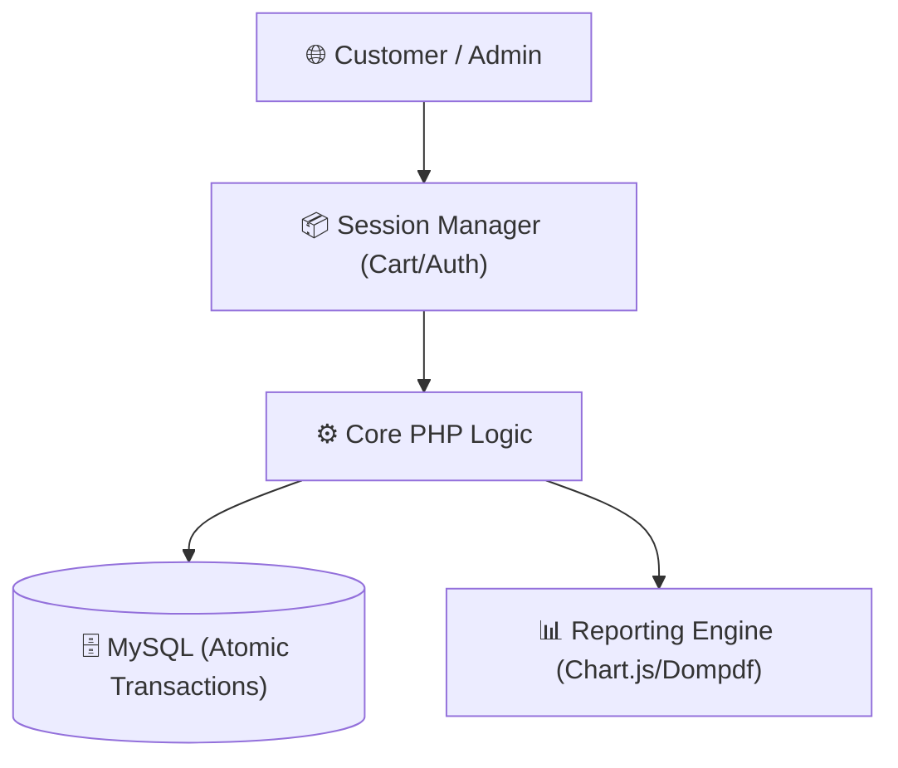
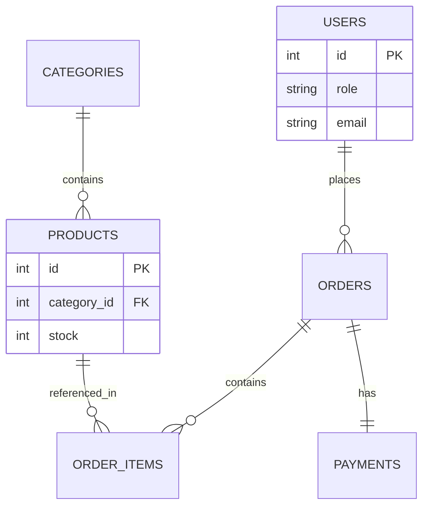

# 🛒 TokoKu — Performance E-Commerce Engine

A performance-optimized E-Commerce platform built with **Vanilla PHP**. Engineered for high-concurrency transaction reliability, utilizing atomic SQL operations, strictly enforced relational data integrity, and real-time inventory synchronization.

[](https://tokoku-ecommerce-production.up.railway.app)
[](https://php.net)
[](https://mysql.com)
[](https://getbootstrap.com)

---

## 🏗 System Architecture

The project manages a complex lifecycle from session-based cart state to atomic database persistence.



---

## ✨ Key Features

- **🛒 Transactional Checkout:** Uses atomic SQL sequences to prevent stock race conditions during simultaneous orders.
- **🔐 Multi-Role RBAC:** Distinct operational views and permissions for `Customer` and `Admin` users.
- **📊 Real-time Inventory:** automated stock deduction and restoration logic on order fulfillment or cancellation.
- **🎫 Dynamic Voucher Engine:** High-precision server-side discount calculation for stacked vouchers.
- **📄 Audit-Ready Analytics:** Professional PDF invoice generation and interactive sales trend visualization.

---

## 🗄 Database Schema

Designed for high relational integrity with strictly defined foreign key constraints.



---

## 🚀 Installation & Usage

### Prerequisites
- PHP 8.0+
- MySQL 8.0
- Composer

### Local Setup
1. **Clone & Install:**
   ```bash
   git clone https://github.com/B3rlinSugi/tokoku-ecommerce.git
   cd tokoku-ecommerce
   composer install
   ```

2. **Database:**
   Create a database named `tokoku` and import `database.sql`.

3. **Config:**
   Update `config/database.php` with your credentials.

---

## 👨‍💻 Developed By

**Berlin Sugiyanto Hutajulu**

[](https://github.com/B3rlinSugi)
[](https://linkedin.com/in/berlinsugi)
[](https://berlinsugi.vercel.app)

---
<p align="center">Built with ❤️ and Vanilla PHP · Serious E-Commerce Engineering</p>

